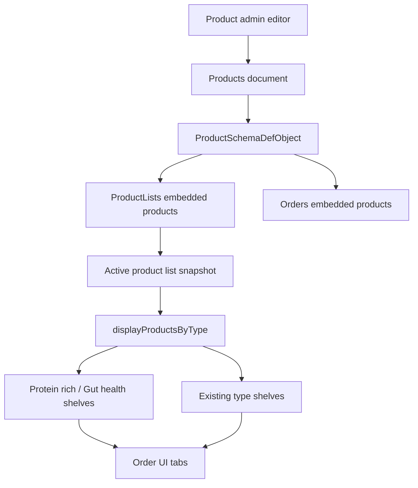

# feat: Add health product shelves

## Summary

Add two health-focused order shelves, `Protein rich` and `Gut health`, that can include products already shown in their normal product type shelves. The implementation should introduce a multi-value product taxonomy field, expose it in product admin, copy it into product-list snapshots, and render the new shelves in the order UI.

---

## Problem Frame

Products currently have one canonical `type` and one free-text `category`. The order screen already supports duplicated merchandising shelves through `displayAsSpecial`, where a product appears in `New Arrivals` while still appearing under its normal type. Health-focused shelves need the same additive behavior because one product can be protein rich, gut-health friendly, and still belong to an existing product type such as Dhals, Milk, Nuts, or Prepared.

---

## Requirements

- R1. Admin users can mark a product as `Protein rich`, `Gut health`, both, or neither without changing the product's existing `type` or `category`.
- R2. Products tagged for a health shelf appear in that health shelf and still appear in their original product type shelf.
- R3. The active product-list snapshot carries the health shelf tags so ordering, cart, and order copies validate with the same product schema.
- R4. The order screen shows `Protein rich` and `Gut health` as selectable shelves alongside existing shelves.
- R5. Existing products without health shelf tags continue to validate, display, and order unchanged.
- R6. Tests cover schema validation and grouping behavior for untagged, singly tagged, and multiply tagged products.

---

## Key Technical Decisions

- **Use a new array field instead of overloading `type` or `category`:** `type` is the single canonical product shelf, while `category` is used as the subcategory heading inside a shelf. A new field such as `curatedCategories` preserves those meanings and supports multiple shelves.
- **Model health shelves as curated categories, not product types:** `ProductTypeName` represents inventory-style product families. Health shelves are merchandising overlays, similar to `displayAsSpecial`, so they should be grouped additively.
- **Store stable keys and render display labels from constants:** Values like `proteinRich` and `gutHealth` are safer to persist than display strings. Display text should come from `imports/modules/constants.js`.
- **Let product-list snapshots inherit the field through `ProductSchemaDefObject`:** `ProductLists` and `Orders` clone the product schema, so adding the field once to `ProductSchemaDefObject` keeps embedded products valid across active lists and order documents.
- **Add tests around pure grouping/schema behavior first:** The order UI has limited existing automated coverage. Schema and grouping tests provide the strongest guard before any browser-level verification.

---

## High-Level Technical Design

The implementation should keep the current product-list flow: admins update products, product lists snapshot orderable products, and the order UI groups products from the active product list. The new health shelf field rides through that same path instead of adding a separate collection or lookup.

---

## Implementation Units

### U1. Define curated product categories

- **Goal:** Add the data model and constants for multi-shelf health tagging.
- **Requirements:** R1, R3, R5.
- **Dependencies:** None.
- **Files:**
  - `imports/modules/constants.js`
  - `imports/api/Products/Products.js`
  - `tests/product-curated-categories.test.js`
  - `tests/main.js`
- **Approach:** Add a `ProductCuratedCategory` constant with `proteinRich` and `gutHealth` entries, plus a derived names array for validation and UI options. Add `curatedCategories` as an optional array of strings on `ProductSchemaDefObject`, ideally with allowed values from the constants if import direction remains clean. Because `ProductLists` and `Orders` clone `ProductSchemaDefObject`, avoid separate schema edits unless validation reveals the clone needs explicit handling.
- **Patterns to follow:** `ProductTypeName` and derived arrays in `imports/modules/constants.js`; shared product schema cloning in `imports/api/ProductLists/ProductLists.js` and `imports/api/Orders/Orders.js`.
- **Test scenarios:**
  - A product without `curatedCategories` validates successfully.
  - A product with `curatedCategories: ['proteinRich']` validates successfully.
  - A product with both `proteinRich` and `gutHealth` validates successfully.
  - If allowed values are enforced, an unknown curated category fails validation.
- **Verification:** Product, product-list embedded product, and order embedded product schemas accept the new optional field without requiring existing records to be migrated.

### U2. Add admin controls for health shelves

- **Goal:** Let admins assign products to either health shelf from the existing product editor.
- **Requirements:** R1, R5.
- **Dependencies:** U1.
- **Files:**
  - `imports/ui/components/ProductsAdmin/Product.js`
  - `tests/product-curated-categories.test.js`
- **Approach:** Add two checkbox controls in the expanded product editor near `Type` and `Category`. Update `handleProductUpsert` with a `curatedCategories` branch that toggles array membership rather than treating the value as a trimmed scalar string. Ensure the update payload sends an array and leaves absent/empty arrays valid.
- **Patterns to follow:** Existing boolean checkbox branches for `availableToOrder`, `displayAsSpecial`, and `frequentlyOrdered`; existing `updateDatabase` path for product upserts.
- **Test scenarios:**
  - Toggling `Protein rich` on a product with no curated categories produces `['proteinRich']`.
  - Toggling `Gut health` on a product already tagged `proteinRich` produces both tags without losing the first.
  - Toggling `Protein rich` off removes only `proteinRich` and preserves `gutHealth`.
  - Saving a product with no health tags does not send invalid scalar or empty-string values.
- **Verification:** Admin can save a product with zero, one, or two health tags, and the product upsert method receives schema-valid data.

### U3. Group products into additive health shelves

- **Goal:** Build `productProteinRich` and `productGutHealth` groups without changing normal product type grouping.
- **Requirements:** R2, R5, R6.
- **Dependencies:** U1.
- **Files:**
  - `imports/ui/components/Orders/ProductsOrderCommon/ProductsOrderCommon.js`
  - `tests/product-curated-categories.test.js`
- **Approach:** Add two arrays in `displayProductsByType`. During the product loop, push the product descriptor into each matching health shelf when `curatedCategories` includes the matching key. Keep the existing `switch` on `product.type` unchanged so products still land in their canonical shelf. Use distinct React keys for health shelf entries.
- **Patterns to follow:** Existing additive `displayAsSpecial` grouping in `displayProductsByType`; existing group metadata updates through `incrementMetaWithOrderCount`.
- **Test scenarios:**
  - A product tagged `proteinRich` appears in `productProteinRich` and in its normal type array.
  - A product tagged `gutHealth` appears in `productGutHealth` and in its normal type array.
  - A product tagged with both appears in both health arrays and its normal type array.
  - An untagged product appears only in its normal type array.
  - Quantity metadata increments for health shelves when a tagged product has a selected quantity.
- **Verification:** The grouping function returns the two new arrays and preserves all existing arrays for current product types.

### U4. Render health shelves in the order UI

- **Goal:** Add selectable `Protein rich` and `Gut health` shelves to the order screen.
- **Requirements:** R2, R4, R5.
- **Dependencies:** U3.
- **Files:**
  - `imports/ui/components/Orders/ProductsOrderMobile/ProductsOrderMobile.js`
  - Optional: `public/app/imgProteinRich.png`
  - Optional: `public/app/imgGutHealth.png`
- **Approach:** Destructure the two new product groups from `productGroups`. Add sidebar nav links and matching `Tab.Pane` entries. Reuse `displayProductsWithCategories` so health shelves still group by each product's existing `category` subheading. Use existing imagery temporarily only if product-specific images are not available yet; add dedicated images if design wants distinct shelf icons.
- **Patterns to follow:** Existing `New Arrivals` sidebar link and `specials` tab; existing type tabs in `ProductsOrderMobile`.
- **Test scenarios:**
  - When `productProteinRich` has products, selecting `Protein rich` displays those products grouped by subcategory.
  - When `productGutHealth` has products, selecting `Gut health` displays those products grouped by subcategory.
  - Empty health shelves display the same empty-category message used by existing tabs.
  - Selecting health shelves does not alter selected quantities in the cart for products also visible in their normal type shelf.
- **Verification:** The order screen can navigate to both health shelves, display tagged products, and preserve quantity state across duplicate shelf appearances.

### U5. Refresh product-list snapshots and rollout data

- **Goal:** Ensure current ordering data includes the new tags after code deploy.
- **Requirements:** R3, R5.
- **Dependencies:** U1, U2.
- **Files:**
  - `imports/api/ProductLists/methods.js`
  - `imports/ui/components/ProductsAdmin/ListAllProducts.js`
- **Approach:** Confirm the existing product-list upsert flow pulls current products from `Products` and snapshots the new field automatically. After tagging products, regenerate or update the active product list through the existing Manage ProductLists flow so `productOrderList.view` publishes product snapshots that contain `curatedCategories`. Avoid adding an automatic migration unless active product lists cannot be safely refreshed operationally.
- **Patterns to follow:** `updateWithTotQuantityOrdered` and product-list upsert flow in `imports/api/ProductLists/methods.js`.
- **Test scenarios:**
  - Updating a product list after tagging products copies `curatedCategories` into `ProductLists.products`.
  - Existing `totQuantityOrdered` values are preserved when the product list is refreshed.
  - Products without health tags remain valid in refreshed product lists.
- **Verification:** After refresh, the active product list includes tagged products with `curatedCategories`, and the ordering page receives those fields from `productOrderList.view`.

### U6. Add focused regression coverage and manual verification

- **Goal:** Lock the behavior down without overbuilding test infrastructure.
- **Requirements:** R1, R2, R3, R4, R5, R6.
- **Dependencies:** U1, U2, U3, U4, U5.
- **Files:**
  - `tests/main.js`
  - `tests/product-curated-categories.test.js`
  - Optional: `imports/ui/components/Orders/ProductsOrderCommon/ProductsOrderCommon.test.js`
- **Approach:** Import the new focused test file from `tests/main.js`. Prefer pure tests for schema and grouping logic because they run under the existing Meteor Mocha setup. Add a lightweight manual QA checklist for the admin editor and order UI if full browser automation is not already established in the repo.
- **Patterns to follow:** Existing `tests/main.js` Meteor Mocha entrypoint.
- **Test scenarios:**
  - Schema accepts missing, one-tag, and two-tag curated categories.
  - Grouping duplicates tagged products into health shelves without removing normal shelf placement.
  - Admin toggle helper or extracted pure function handles add/remove array behavior.
  - Product-list refresh carries tags into embedded product snapshots.
- **Verification:** Meteor tests pass for the new schema/grouping coverage, and manual QA confirms the two shelves appear in the order UI with real tagged products.

---

## Scope Boundaries

- **In scope:** Product data model, admin tagging controls, additive grouping, order UI shelves, focused automated tests, and operational refresh of product-list snapshots.
- **Deferred to follow-up work:** Nutrition metadata, product recommendation algorithms, personalized health filtering, SEO/content pages for health benefits, and dedicated visual design beyond optional shelf icons.
- **Out of scope:** Changing the meaning of existing product `type`, changing subcategory behavior, or replacing product-list snapshotting.

---

## Risks & Dependencies

- **Active product-list snapshots may lag product edits:** The code can support the field while the order screen still uses an old active product list. Mitigate by refreshing the active product list after tagging products.
- **Existing tests may not be clean at baseline:** `tests/main.js` currently asserts the package name is `meteor-app`, while `package.json` says `NammaSuvai`. Fix or isolate that baseline issue before treating test failures as caused by this feature.
- **Admin UI state currently mutates product objects in place:** The new array toggle should avoid accidental scalar conversion or stale state by handling arrays carefully.
- **Icon availability is a design dependency:** Dedicated shelf icons are optional; the feature can ship with existing imagery if visual polish is deferred.

---

## Sources & Research

- `imports/api/Products/Products.js` defines the canonical product schema, including `type`, `category`, and `displayAsSpecial`.
- `imports/api/ProductLists/ProductLists.js` and `imports/api/Orders/Orders.js` clone `ProductSchemaDefObject` for embedded products.
- `imports/ui/components/Orders/ProductsOrderCommon/ProductsOrderCommon.js` already duplicates products into `productSpecials` without removing their normal type grouping.
- `imports/ui/components/Orders/ProductsOrderMobile/ProductsOrderMobile.js` manually renders sidebar links and panes for each order shelf.
- `imports/ui/components/ProductsAdmin/Product.js` owns the current product upsert and admin field controls.
