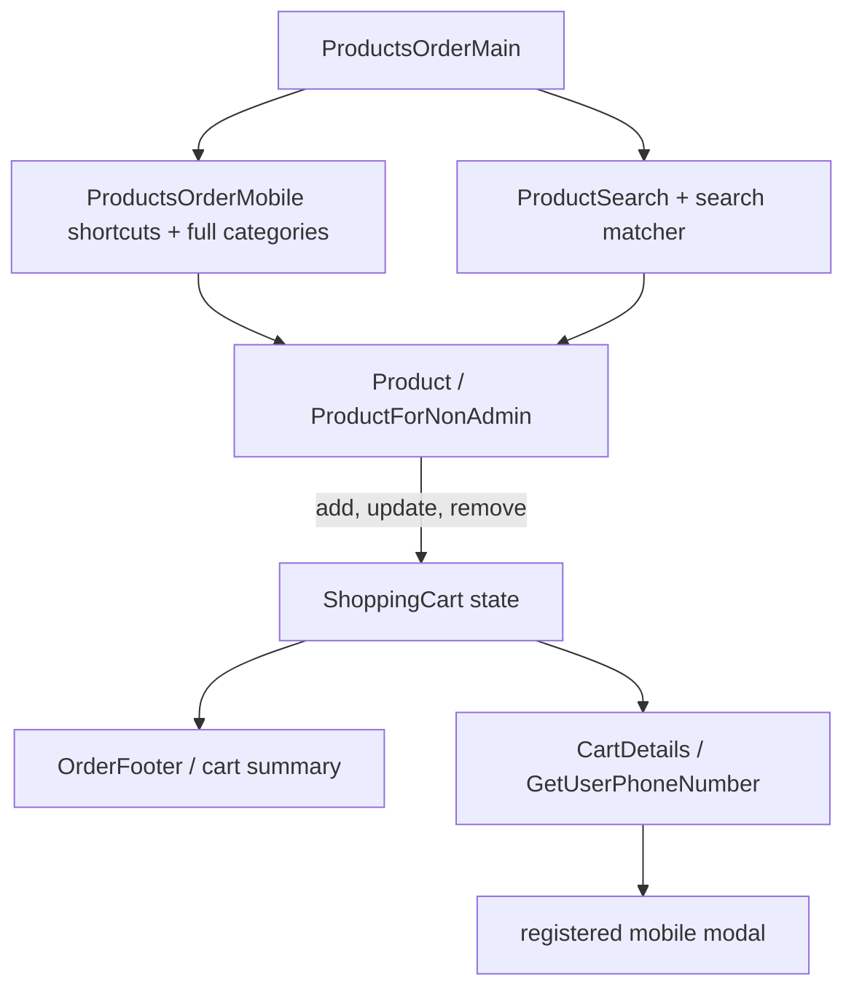
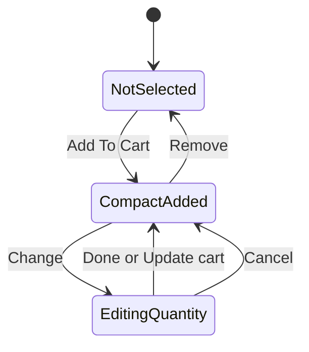

# feat: Improve product order page mobile and web usability

## Summary

Improve the Suvai product ordering page so less technical shoppers can start with search, browse calmer category shortcuts, add products without card expansion, edit quantities only when needed, and reach checkout with clearer expectations. The plan keeps the current cart, quantity, returnable, category, and checkout model intact while changing the retail ordering presentation.

---

## Problem Frame

The current product page works, but it asks mobile shoppers to parse a long category rail, dense product cards, icon-only navigation, and an expanded quantity selector immediately after adding an item. The requirements document frames this as a confidence and readability problem for customers age 60+ and less technical returning shoppers, while preserving power-user category browsing and desktop ordering efficiency.

---

## Requirements

### Discovery and Navigation

- R1. Search is visible without scrolling on the product order page, uses plain example copy like `Search rice, dhal, milk...`, remains available while browsing, and keeps category browsing available.
- R2. Assisted search returns product cards with name, unit, price, and category, supports direct add-to-cart from results, and provides helpful suggestions or category fallbacks when exact matches fail.
- R3. Mobile shoppers get a short set of common entry points near search, while the full category list and existing direct category/subcategory URLs remain reachable.

### Add, Quantity, and Cart Feedback

- R4. Retail product cards switch from `Add To Cart` to a compact selected state showing the selected quantity, clear change and remove actions, and no substantial card-height jump.
- R5. Quantity choices open only after the shopper chooses to edit quantity, preserve `unitsForSelection`, support cancel/close without losing the current selection, and keep returnable packaging choices available.
- R6. Mobile layout reduces visual density, uses comfortable touch targets, preserves readable names and prices, keeps selected state clear, and keeps a cart/checkout affordance visible after items are selected.
- R7. Web layout keeps category browsing efficient, places search above the grid, uses compact selected cards, and keeps a prominent cart summary visible.

### Accessibility and Checkout Readiness

- R8. Header, toolbar, cart, menu, remove, and quantity controls have clear accessible names, visible focus states, and screen-reader-friendly cart count changes.
- R9. Product order and cart pages tell shoppers that unauthenticated checkout uses a registered mobile number, point new users toward sign up without blocking browsing, and show authenticated users who they are ordering as.
- R10. Existing cart totals, category routing, product grouping, returnable choices, checkout, admin/shop-owner views, basket flows, saved/edit-order flows, and empty states are not regressed.

---

## Key Technical Decisions

- KTD1. Scope compact selected state to non-admin retail product cards first: `ProductForNonAdmin` is the density source, while admin/shop-owner and checkout paths use the same component for operational editing and should not inherit retail browsing behavior accidentally.
- KTD2. Keep quantity editing local to the product card: inline expansion is the lowest-risk first release because it preserves the current `onChange` contract and returnable logic without introducing a modal, portal, or bottom-sheet lifecycle.
- KTD3. Implement assisted search as a reusable product-matching layer before UI polish: matching by normalized name, aliases, and category fallback should be testable without rendering the page, while `ProductSearch` can stay responsible for presentation and `search.captureSearchString`.
- KTD4. Treat mobile common entry points as shortcuts into existing product groups: this keeps curated category behavior additive, preserves direct category URLs, and avoids new schema work for the first release.
- KTD5. Restore real responsive intent before desktop polish: `ProductsOrderMain` currently hard-codes mobile mode, so web layout improvements must first separate mobile and desktop presentation without changing product grouping.
- KTD6. Add cart and checkout readiness messaging with existing cart state: visible totals and registered-mobile guidance can use `ShoppingCart`, `ProductsOrderCommon.OrderFooter`, and `CartDetails` without changing order persistence.
- KTD7. Add accessible names at the button/control boundary: icon rendering can remain centralized in `Icon`, while callers provide product-specific labels where context matters, such as remove actions.

---

## High-Level Technical Design

---

## Scope Boundaries

### In Scope

- Retail product ordering page improvements for mobile and desktop web.
- Search-first placement, assisted results, no-results guidance, and first-release alias/category fallback support.
- Compact selected product-card state and local quantity edit state.
- Accessible names and visible focus states for the ordering, header, toolbar, cart, menu, remove, and quantity controls named in the origin document.
- Checkout readiness copy on the product order and cart pages.

### Deferred to Follow-Up Work

- Fixing `/order/success/undefined`; the origin document identifies it as a separate bug.
- Full search analytics instrumentation beyond preserving `search.captureSearchString` and adding clear extension points for first-release search/add events.
- A global modal or mobile bottom sheet for quantity editing if inline editing proves insufficient.
- A user-selectable `Easy ordering` mode; this plan makes the improved layout the default retail ordering experience.

### Out of Scope

- Payment flow redesign, voice ordering, admin product-management redesign, and product schema changes beyond optional first-release search aliases.

---

## Implementation Units

### U1. Extract Search Matching and Suggestions

- **Goal:** Create a deterministic product search helper that supports exact, partial, normalized, alias, and category-fallback matches for the product order page.
- **Requirements:** R1, R2, R10.
- **Dependencies:** None.
- **Files:** `imports/ui/components/Orders/ProductSearch/ProductSearch.js`, `imports/ui/components/Orders/ProductSearch/productSearchHelpers.js`, `tests/product-order-search.test.js`.
- **Approach:** Move product matching out of `ProductsOrderMain.getProductsMatchingSearch` into a helper that accepts products and a query, returns ordered matches plus fallback category suggestions, and keeps `ProductSearch` free to render results. Start with a small alias map for common requirement examples such as `bajra` to Kambu/Bajra products; defer schema-backed aliases unless implementation finds existing product metadata that already carries them.
- **Execution note:** Implement the helper test-first because it is the clearest way to lock spelling, alias, and fallback behavior before touching presentation.
- **Patterns to follow:** `tests/product-curated-categories.test.js` for pure helper coverage around product grouping; `imports/api/Search/methods.js` for preserving captured query behavior.
- **Test scenarios:**
  - Search `thinai` against products containing Thinai returns matching products before category fallbacks.
  - Search `kambu avale` returns `KAMBU AVAL / BAJRA FLAKES` when present despite case differences.
  - Search `bajra` returns Kambu/Bajra aliases and the Millets fallback when matching products are limited.
  - Search with fewer than the configured minimum characters returns no product results and no noisy fallback list.
  - Search with no exact product match returns a plain-language no-results state and category fallback data.
  - Existing `search.captureSearchString` still receives non-empty queries when the field blurs or clears.
- **Verification:** Search behavior is covered by helper tests, and `ProductSearch` still accepts a `getProductsMatchingSearch` or equivalent callback compatible with the order page.

### U2. Make Search and Guided Entry Primary

- **Goal:** Rework the product order page entry area so search appears first and mobile users see a short set of common category shortcuts before the full category list.
- **Requirements:** R1, R3, R6, R7, R10.
- **Dependencies:** U1.
- **Files:** `imports/ui/components/Orders/ProductsOrderMain/ProductsOrderMain.js`, `imports/ui/components/Orders/ProductsOrderMobile/ProductsOrderMobile.js`, `imports/ui/components/Orders/ProductSearch/ProductSearch.js`, `imports/ui/components/Orders/ProductsOrderMobile/ProductsOrderMobile.scss`, `imports/ui/components/Orders/ProductsOrderMain/ProductsOrderMain.scss`, `tests/product-order-search.test.js`.
- **Approach:** Keep `ProductSearch` mounted near the top of `ProductsOrderMain`, simplify its placeholder and empty state, and render search results with enough metadata to satisfy name, unit, price, and category expectations. Add mobile shortcut buttons that select existing category tab keys such as vegetables, rice, protein rich, gut health, dhals, milk, and breakfast-like prepared items when available. Preserve `goToCategoryAndSubCategory` for direct category URLs, keep full category navigation reachable through an `All categories` affordance, and replace the hard-coded mobile mode with responsive branching that lets desktop-specific layout polish take effect.
- **Patterns to follow:** `ProductsOrderMobile.returnSideBarNavLink` for category selection, `constants.ProductCuratedCategory` for curated health shelves, and `ProductsOrderCommon.displayProductsByType` for group names.
- **Test scenarios:**
  - On `/neworder` mobile viewport, the search input is visible before product cards and uses common grocery example copy.
  - Search results show product name, unit, price, and category before the shopper adds an item.
  - Tapping a common shortcut scrolls or selects the matching existing category without changing product grouping.
  - Tapping `All categories` exposes the complete category list.
  - Existing direct category/subcategory route props still select and scroll to the requested section.
  - Desktop viewport does not use the mobile-only category rail by default once responsive branching is restored.
  - Empty product groups still show the existing empty category message.
- **Verification:** Browser verification on mobile and desktop shows search first, common shortcuts visible on mobile, and no regression to category URL navigation.

### U3. Add Compact Selected Product State

- **Goal:** Replace immediate quantity-selector expansion with a compact selected state for retail browsing cards.
- **Requirements:** R4, R6, R7, R10.
- **Dependencies:** None.
- **Files:** `imports/ui/components/Orders/ProductForNonAdmin.js`, `imports/ui/components/Orders/Product.scss`, `tests/product-order-card-state.test.js`.
- **Approach:** Split the retail add control into three states: not selected, compact selected, and editing. After `Add To Cart`, update the cart with the first non-zero quantity as today, then render selected quantity text, `Change quantity`, and `Remove` controls. Keep checkout and slider-view behavior compatible unless implementation confirms slider-view should share the compact state.
- **Patterns to follow:** Existing `AddToCart`, `QuantitySelector`, `displayUnitOfSale`, and `cartActions.updateCart` event shape.
- **Test scenarios:**
  - Covers R4. Clicking `Add To Cart` on a retail product dispatches the first non-zero `unitsForSelection` quantity and renders `Added · <quantity>`.
  - The compact selected state keeps the product card height stable within the existing grid constraints.
  - Clicking `Remove` dispatches quantity `0` and returns the card to `Add To Cart`.
  - Products with sale badges still display the badge without overlapping selected-state controls.
  - Checkout product rows still render the full quantity selector for cart review.
- **Verification:** Component or browser tests prove the add/remove contract, and visual inspection confirms selected cards do not expand substantially after a simple add.

### U4. Add Local Quantity Edit State

- **Goal:** Show quantity options only when the shopper asks to change quantity, while preserving cancel and returnable behavior.
- **Requirements:** R5, R6, R7, R10.
- **Dependencies:** U3.
- **Files:** `imports/ui/components/Orders/ProductForNonAdmin.js`, `imports/ui/components/Orders/Product.scss`, `tests/product-order-card-state.test.js`.
- **Approach:** Add local editing state inside the non-admin product card. Opening `Change quantity` shows the existing `QuantitySelector` values from `unitsForSelection`, marks the current quantity, and provides `Done` plus `Cancel`/close behavior. Returnable choices remain displayed only inside the edit state when applicable, using the current `AddReturnable` and `onChange` payload shape.
- **Patterns to follow:** Existing `QuantitySelector` and `AddReturnable` components; `costOfReturnable` for returnable quantity/price coupling.
- **Test scenarios:**
  - Clicking `Change quantity` opens valid quantities from `unitsForSelection`.
  - Selecting a new quantity and clicking `Done` updates the cart and returns to compact selected state with the new quantity.
  - Clicking `Cancel` returns to compact selected state without changing the previous selected quantity.
  - A product with `includeReturnables` still supports toggling returnable packaging while editing.
  - Removing from the edit state clears the product and hides returnable controls.
- **Verification:** Tests cover edit, done, cancel, remove, and returnable branches; browser verification confirms touch targets are comfortable on mobile.

### U5. Add Cart Summary and Checkout Readiness Messaging

- **Goal:** Keep cart progress and checkout requirements visible without changing checkout identity or order persistence.
- **Requirements:** R6, R7, R9, R10.
- **Dependencies:** U3.
- **Files:** `imports/ui/components/Orders/ProductsOrderMain/ProductsOrderMain.js`, `imports/ui/components/Orders/ProductsOrderCommon/ProductsOrderCommon.js`, `imports/ui/components/Cart/CartDetails.js`, `imports/ui/components/Cart/GetUserPhoneNumber.js`, `imports/ui/components/Cart/CartCommon.js`, `tests/product-order-checkout-readiness.test.js`.
- **Approach:** Extend the product-page footer/cart summary so selected item count and total remain visible after an item is added, using existing `ShoppingCart` totals. Add non-error copy on product and cart screens explaining registered-mobile checkout for unauthenticated users, and authenticated ordering identity where the user context is available. Keep `GetUserPhoneNumber` as the final identity capture modal.
- **Patterns to follow:** `ProductsOrderCommon.OrderFooter` for product-page checkout affordance, `CartCommon.OrderFooter` for cart total layout, and `CartDetails.handleOrderSubmit` for unauthenticated checkout branching.
- **Test scenarios:**
  - After adding one product on mobile, the cart summary or checkout affordance remains visible and shows a non-zero total.
  - On desktop, the cart summary remains prominent while browsing and updates after adding from search and category browsing.
  - Unauthenticated shoppers see registered-mobile guidance before the final modal.
  - New shoppers are pointed to sign up without blocking browsing.
  - Authenticated shoppers see who they are ordering as, or the existing admin on-behalf selection remains the authority when applicable.
- **Verification:** Browser verification covers mobile and desktop cart-progress visibility, and checkout still opens `GetUserPhoneNumber` only when unauthenticated.

### U6. Improve Accessible Names and Focus States

- **Goal:** Ensure icon-only controls and dynamic cart status have understandable accessible text and visible keyboard focus.
- **Requirements:** R8, R10.
- **Dependencies:** U3, U5.
- **Files:** `imports/ui/components/AuthenticatedNavigation/Menu.js`, `imports/ui/components/ToolBar/ToolBar.js`, `imports/ui/components/Orders/ProductSearch/ProductSearch.js`, `imports/ui/components/Orders/ProductForNonAdmin.js`, `imports/ui/components/Orders/Product.scss`, `imports/ui/components/ToolBar/ToolBar.scss`, `tests/product-order-accessibility.test.js`.
- **Approach:** Add `aria-label` values to profile, cart, menu, toolbar, search-clear, remove, and quantity-edit buttons. Include product names in remove labels where possible, and add a polite status region or accessible cart-count text where cart count changes are otherwise visual-only.
- **Patterns to follow:** Existing Bootstrap `Button` usage and `Icon` presentation; keep icons decorative where the button label carries the accessible name.
- **Test scenarios:**
  - Header buttons expose names such as profile, cart, and menu instead of concatenated icon names.
  - Toolbar buttons expose home, messages, cart, and wallet names.
  - Search clear button exposes a clear-search label.
  - Remove control for a selected product includes the product name.
  - Cart count changes are announced or exposed through accessible text when a product is added.
  - Keyboard focus is visible on add, change, remove, search, shortcut, and checkout controls.
- **Verification:** Browser accessibility inspection confirms controls have names and focus states; no visible text regression is introduced for compact layouts.

### U7. Add Browser Regression Coverage for Mobile and Web Ordering

- **Goal:** Cover the cross-component behaviors that helper and component tests cannot prove.
- **Requirements:** R1, R2, R3, R4, R5, R6, R7, R8, R9, R10.
- **Dependencies:** U1, U2, U3, U4, U5, U6.
- **Files:** `tests/product-order-page-flow.test.js`, `tests/product-order-search.test.js`, `tests/product-order-card-state.test.js`, `tests/product-order-accessibility.test.js`, `package.json`.
- **Approach:** Add or extend browser-capable test coverage if the repo already has a full-app test harness available; otherwise document the manual browser verification matrix beside the test file that can run under `meteor test --full-app`. Keep pure helper tests under the existing Mocha setup.
- **Patterns to follow:** `package.json` `test` and `test-app` scripts; existing Mocha test style in `tests/product-curated-categories.test.js`.
- **Test scenarios:**
  - Mobile: load `/neworder`, search exact, search partial, use alias suggestion, add from search, confirm compact state, edit quantity, remove, browse category, continue to cart.
  - Web: load `/neworder`, browse categories, search above grid, add from search and category browsing, confirm compact selected cards, edit quantity locally, and confirm cart summary updates.
  - Regression: direct category URLs, no-products empty state, returnable options, admin/shop-owner views, basket/edit-order flows, and saved order flows remain usable.
  - Accessibility: icon-only controls have names and focus can move through the ordering workflow.
- **Verification:** The final implementation has a repeatable automated or documented browser-verification path covering mobile and desktop ordering.

---

## System-Wide Impact

This work affects the main retail ordering path, the cart handoff, shared navigation controls, and product-card rendering used in checkout and slider contexts. The implementation must protect admin/shop-owner workflows and cart review behavior because those surfaces share `Product`, `ProductForNonAdmin`, `QuantitySelector`, and `OrderFooter` components.

---

## Risks & Dependencies

- **Shared component regression:** `ProductForNonAdmin` serves retail browsing and checkout review. Mitigate by gating compact browsing behavior away from checkout and adding regression tests for checkout quantity editing.
- **Search alias overreach:** Hardcoded aliases can drift. Keep first-release aliases small, tested, and clearly isolated so schema-backed aliases can replace them later.
- **Mobile density trade-off:** Shortcuts plus search can still crowd small screens. Mitigate with a collapsed full category list and touch-size verification.
- **Returnable packaging complexity:** Returnable choice depends on selected quantity. Preserve the current `AddReturnable` payload shape and test quantity changes with returnables enabled.
- **Browser harness uncertainty:** The repo has Mocha tests and `meteor test --full-app`, but no obvious existing browser-flow suite in the inspected files. Implementation may need to add a minimal harness or record manual browser verification if automation support is not practical in the first pass.

---

## Sources & Research

- Origin requirements: `docs/requirements/2026-06-21-product-order-page-mobile-web-improvements.md`.
- Ideation references: `docs/ideation/2026-06-21-senior-friendly-order-browsing-ideation.html`, `docs/ideation/2026-06-21-assisted-search-first-layouts.html`, `docs/ideation/2026-06-21-compact-added-product-card-layouts.html`.
- Existing order page: `imports/ui/components/Orders/ProductsOrderMain/ProductsOrderMain.js`, `imports/ui/components/Orders/ProductsOrderMobile/ProductsOrderMobile.js`, `imports/ui/components/Orders/ProductSearch/ProductSearch.js`.
- Product-card and quantity behavior: `imports/ui/components/Orders/Product.js`, `imports/ui/components/Orders/ProductForNonAdmin.js`, `imports/ui/components/Orders/Product.scss`.
- Product grouping and curated categories: `imports/ui/components/Orders/ProductsOrderCommon/ProductsOrderCommon.js`, `imports/modules/constants.js`, `tests/product-curated-categories.test.js`.
- Cart and checkout readiness surfaces: `imports/ui/components/Cart/CartDetails.js`, `imports/ui/components/Cart/GetUserPhoneNumber.js`, `imports/ui/components/Cart/CartCommon.js`.
- Navigation accessibility surfaces: `imports/ui/components/AuthenticatedNavigation/Menu.js`, `imports/ui/components/ToolBar/ToolBar.js`.
